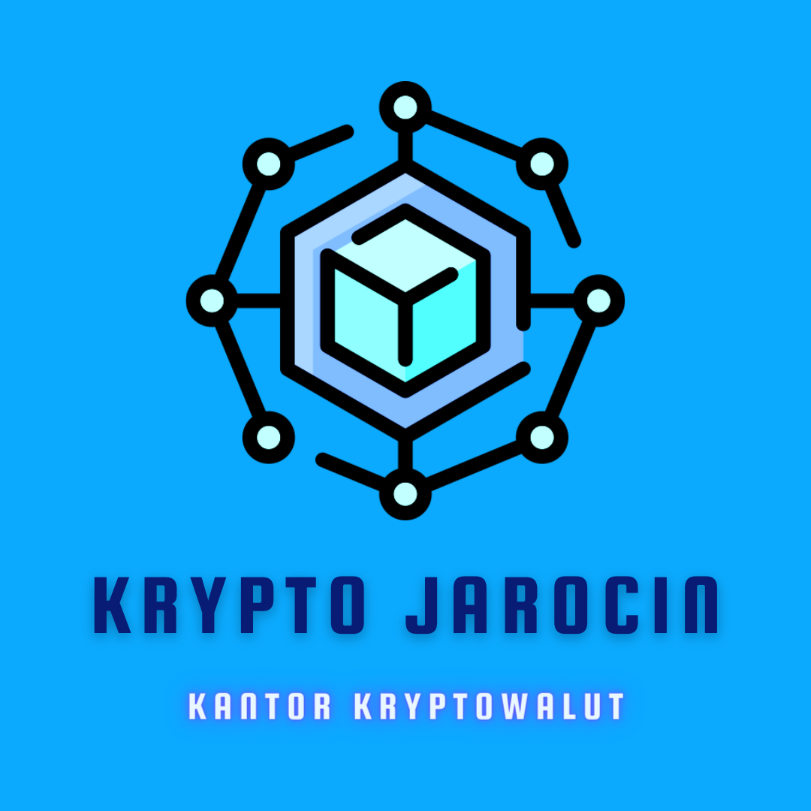

## About 


<br />
<div align="center">
  <a href="https://github.com/g4n3sha5/Krypto-Jarocin">
    
  </a>

  
<h3 align="center">Auratek</h3>

  <p align="center">
   Page for personal Crypto Exchange business
    
  </p>
</div>

[](www.kryptojarocin.pl)

### Built With


# How to run?
Live on www.kryptojarocin.pl
1. Clone the repo
   ```sh
   git clone https://github.com/github_username/repo_name.git
   ```
2. Install NPM packages
   ```sh
   npm install
   ```
3. Run server 
   ```sh
   npm run dev
   ```
Open [http://localhost:3000](http://localhost:3000) to view it in your browser.


